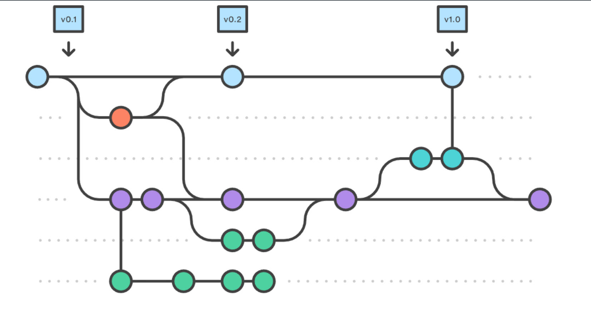
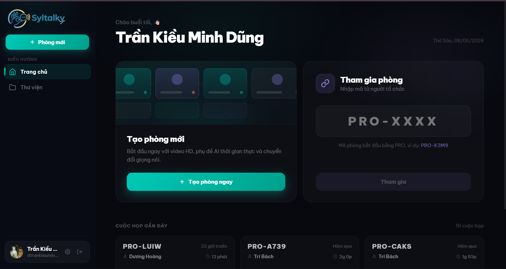
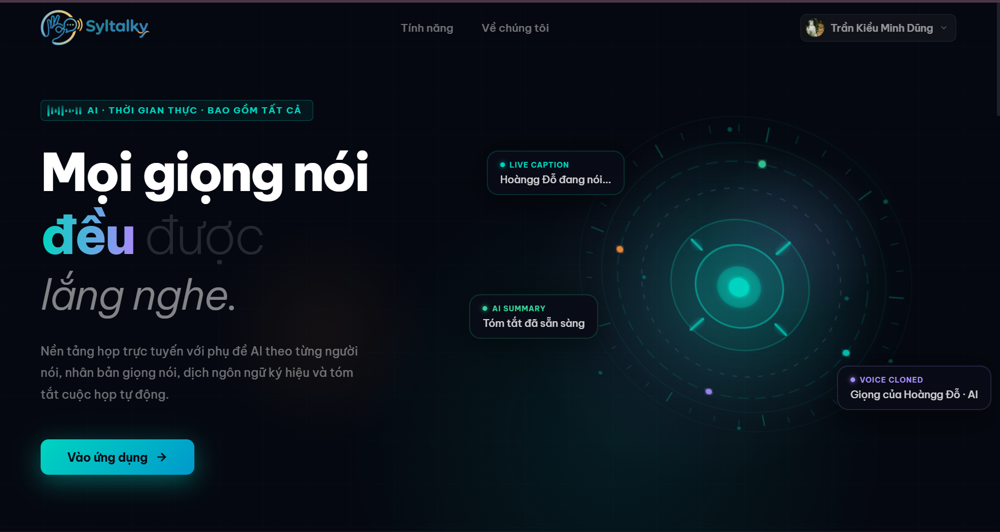
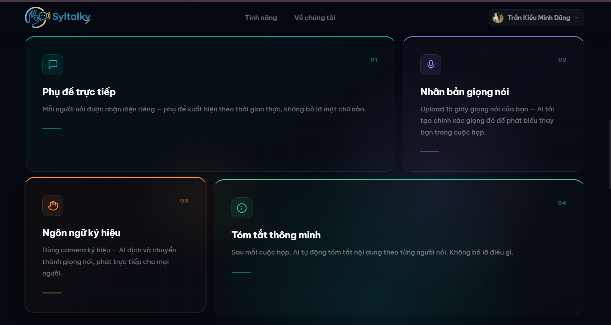

# Báo Cáo Kết Quả Bài Tập cuối khóa 

## 1. Thông Tin Nhóm

**Tên Dự Án:** **Syltalky**

**Link Dự Án:** [Syltalky](https://syltalky.pro.vn/)

**Thành Viên Nhóm (D24):**
- Đỗ Phạm Bảo Hoàng.
- Trần Kiều Minh Dũng.
- Vương Trí Bách.
- Dương Đỗ Hoàng.
 
**Mentor (D23):**
- Nguyễn Hải Long.
- Hoàng Văn Chính.
- Hán Hữu Đăng.

### Mô hình làm việc
Mỗi tuần, team sẽ ngồi lại để review công việc đã làm, cùng nhau giải quyết vấn đề và đề xuất giải pháp cho tuần tiếp theo. Sau đó sẽ có buổi demo cho mentor để nhận phản hồi và hướng dẫn.

### Version Control Strategy
Team hoạt động theo Gitflow để quản lý code. Mỗi thành viên sẽ tạo branch từ `develop` để làm việc, các branch đặt theo format `feature/ten-chuc-nang`, sau khi hoàn thành sẽ tạo Pull Request để review code và merge vào develop
- Các nhánh chính:
  - `main`: Chứa code ổn định, đã qua kiểm tra và test kỹ lưỡng
  - `develop`: Chứa code mới nhất, đã qua review và test
  - `feature/`: Các nhánh chứa code đang phát triển, short-live, sau khi hoàn thành sẽ merge vào `develop`. 



Sau mỗi tuần, team sẽ merge `develop` vào `main` để release phiên bản mới.

## 2. Giới Thiệu Dự Án

**Mô tả:** ***Syltalky*** là một nền tảng họp trực tuyến thế hệ mới, đa hỗ trợ, tích hợp công nghệ trí tuệ nhân tạo để cung cấp các giải pháp nâng cao nhằm cải thiện trải nghiệm họp trực tuyến như phụ đề AI, clone giọng nói và phiên dịch ngôn ngữ kí hiệu để chuyển thành giọng nói.

## 3. Các Chức Năng Chính

### 1, Live Captions (Phụ đề trực tiếp)

Backend lấy audio track của từng người tham gia từ LiveKit, stream các đoạn PCM đến WebSocket `/ws/stt` của AI API để thực hiện speech-to-text theo thời gian thực. 

Kết quả phụ đề tiếng Việt sẽ được broadcast lại vào phòng họp ngay lập tức. Phụ đề được hiển thị dưới dạng subtitle overlay trên video của từng người nói, đồng thời được lưu tích lũy trong một bảng Captions có thể cuộn để xem lại toàn bộ nội dung cuộc trò chuyện.

---

### 2, Voice Cloning & Voice Design (Nhân bản và thiết kế giọng nói)

Người dùng có thể ghi âm hoặc tải lên một đoạn audio dài khoảng 5–15 giây để clone giọng nói của mình.

Backend sẽ:
1. Chạy STT để lấy transcript từ audio
2. Gửi cả audio và transcript tới AI API để đăng ký voice model

Trong lúc họp, bảng TTS cho phép người dùng:
- nhập văn bản
- phát âm thanh bằng giọng clone của chính họ
- hoặc sử dụng các giọng thiết kế từ style tags

Âm thanh được tạo ra sẽ được phát tới toàn bộ người tham gia trong cuộc họp.

---

### 3, Sign Language Translation (Dịch ngôn ngữ ký hiệu)

Người dùng có thể tải lên video ASL (American Sign Language) trực tiếp từ giao diện cuộc họp.

Pipeline xử lý gồm:
1. AI API trích xuất pose keypoints bằng RTMPose
2. Đưa dữ liệu vào Uni-Sign để dịch từ ASL → tiếng Anh
3. Dùng EnViT5 để dịch tiếp từ tiếng Anh → tiếng Việt

---

### 4, Meeting History & AI Summaries (Lịch sử cuộc họp và tóm tắt AI)

Sau khi cuộc họp kết thúc, hệ thống sẽ chạy một post-processing job để:
- tổng hợp transcript đầy đủ từ captions đã lưu
- tạo AI summary bằng LLM được cấu hình

Màn hình Library hiển thị:
- danh sách các cuộc họp trước đây
- bản tóm tắt AI
- transcript đầy đủ của từng cuộc họp

---

### 5, Meeting Extras (Các tính năng bổ sung)

Cuộc họp trực tiếp còn hỗ trợ nhiều tính năng khác như:

- Pinned messages
- Polls (single choice / multiple choice)
- Collaborative notes sử dụng Tiptap + Yjs CRDT
- Co-host promotion
- Waiting room với approve-all
- AI chat assistant sử dụng LLM có thể cấu hình

## 4. Công nghệ

### 4.1. Công Nghệ Sử Dụng
##### 4.1.1 Tech stack
**Frontend**
| Library | Purpose |
|---|---|
| React 18 | UI |
| Vite 5 | Build tool + dev server |
| React Router v6 | Client-side routing |
| Zustand | Global auth + user state |
| LiveKit Components React | WebRTC video/audio grid |
| Tiptap + Yjs | Collaborative rich-text notes (CRDT) |
| react-markdown + KaTeX | Markdown + math rendering (meeting summaries) |
| react-easy-crop | Avatar crop UI |

**Backend**
| Component | Version |
|---|---|
| Python | 3.11 |
| FastAPI | latest |
| PostgreSQL | 16 |
| SQLAlchemy (async) | 2.x |
| Alembic | migrations |
| LiveKit Server SDK | Python |
| MinIO | self-hosted S3 |
| Redis | 7 |
| Resend | transactional email |
| Qwen3.5-35B-A3B (OpenAI-compatible proxy) | meeting summaries + AI chat assistant |

##### 4.1.2 Các dịch vụ ngoài
| Service | Purpose |
|---|---|
| LiveKit (self-hosted) | WebRTC audio/video |
| MinIO (self-hosted) | Avatars, reference audio |
| Resend | Transactional email (verify, reset password) |
| Qwen3.5-35B-A3B (OpenAI-compatible proxy) | Meeting summarisation + AI chat assistant |
| Google OAuth | Sign-in with Google |

### 4.2 Cấu trúc dự án

```
Browser (Syltalky_FE)
    │
    ├── HTTP/WS  →  Syltalky_BE (port 8001)
    │                   │
    │                   ├── PostgreSQL  (port 5432)
    │                   ├── MinIO       (port 9000)
    │                   ├── LiveKit     (port 7880)
    │                   ├── Redis       (port 6379)
    │                   └── HTTP  →  Syltalky_API (port 8000)
    │
    └── WebRTC   →  LiveKit (port 7880 / 7882 UDP)
```

**Frontend**
```
Syltalky_FE/
├── src/
│   ├── main.jsx                    ← React root, mounts <Router />
│   ├── App.jsx                     ← Theme provider wrapper
│   ├── router.jsx                  ← All routes + TokenRefresher + page transitions
│   ├── store/index.js              ← Zustand store (auth + user)
│   ├── styles/
│   │   ├── globals.css             ← CSS reset + custom properties
│   │   └── theme.js                ← Design tokens (colours, radii, shadows)
│   ├── api/
│   │   ├── client.js               ← apiFetch wrapper with auto token refresh
│   │   └── meetings.js             ← meetings API
│   ├── components/
│   │   ├── Sidebar.jsx             ← App sidebar
│   │   ├── UserAvatar.jsx          ← Shared avatar with fallback initials
│   │   ├── AudioTrimmer.jsx        ← Waveform trim UI for voice clone
│   │   └── AvatarCropper.jsx       ← react-easy-crop wrapper
│   ├── hooks/
│   │   └── useBreakpoint.js        ← Responsive breakpoint hook
│   ├── layouts/
│   │   └── AppLayout.jsx           ← Main app shell
│   └── screens/
│       ├── LandingPage.jsx
│       ├── HomeScreen.jsx
│       ├── LibraryScreen.jsx
│       ├── MeetingDetailScreen.jsx
│       ├── NotFoundScreen.jsx
│       ├── auth/                   ← Login, Register, ForgotPassword, …
│       ├── meeting/
│       │   ├── DeviceCheckScreen.jsx
│       │   ├── MeetingRoomScreen.jsx
│       │   └── useMeetingExtras.js ← Hook for pins, polls, notes, co-hosts
│       └── settings/               ← SettingsModal + panels
├── public/
│   └── favicon.ico
├── index.html
├── vite.config.js
└── package.json
```

**Backend**
```
Syltalky_BE/
├── app/
│   ├── main.py              ← FastAPI app, lifespan (bucket + voice re-registration)
│   ├── config.py            ← Settings (Pydantic BaseSettings, reads .env)
│   ├── database.py          ← Async SQLAlchemy engine + session factory
│   ├── core/
│   │   ├── deps.py          ← get_current_user dependency
│   │   ├── security.py      ← JWT creation/verification, password hashing
│   │   └── meeting_auth.py  ← require_host_or_cohost, require_participant helpers
│   ├── models/              ← SQLAlchemy ORM models
│   ├── schemas/             ← Pydantic request/response schemas
│   ├── routers/             ← One file per domain (auth, users, meetings, …)
│   └── services/
│       ├── minio_client.py  ← Upload, presigned URL, public URL generation
│       ├── email.py         ← Resend email wrapper
│       └── post_processing.py ← Transcript build + LLM summarise + notify
├── alembic/                 ← Migration scripts
├── docker-compose.yml
├── Dockerfile
└── .env.example
```

**API**
```
Syltalky_API/
├── main.py                 ← sets HF_HOME before any import, starts uvicorn
├── download_model.py       ← downloads all models (called automatically by main.py)
├── requirements.txt
├── demo.html               ← browser demo (sign + STT + TTS)
└── app/
    ├── api.py              ← FastAPI app, mounts all routers
    ├── sign/               ← ASL → Vietnamese (Uni-Sign + RTMPose + EnViT5)
    │   ├── router.py       ← POST /sign
    │   ├── inference.py
    │   ├── rtmlib-main/    ← bundled rtmlib (pip install -e)
    │   ├── checkpoints/    ← openasl_pose_only_slt.pth (gitignored)
    │   └── pretrained_weight/ ← mt5-base/ (gitignored)
    ├── stt/                ← Vietnamese speech → text
    │   ├── router.py       ← POST /stt, WS /ws/stt
    │   ├── inference.py
    │   ├── model/          ← Zipformer ONNX + bpe.model + silero_vad.onnx (gitignored)
    │   └── .hf_cache/      ← HF cache for punct + NER models (gitignored)
    ├── translation/        ← EN → VI (EnViT5, used internally by sign)
    │   ├── inference.py
    │   └── model/          ← EnViT5 weights (gitignored)
    └── tts/                ← Vietnamese text → speech (OmniVoice)
        ├── router.py       ← POST /tts/voice, /tts/synthesize, /tts/design
        ├── inference.py
        ├── omnivoice/      ← bundled OmniVoice source (pip install -e)
        ├── speakers/       ← preset speaker ref audio (reserved)
        └── checkpoints/    ← omnivoice-vietnamese weights (gitignored)
```

Frontend chỉ giao tiếp với backend. Backend sẽ trung gian xử lý và chuyển toàn bộ các tác vụ AI sang AI API. AI API yêu cầu GPU hỗ trợ CUDA để hoạt động.


## 5. Ảnh và Video Demo

**Ảnh Demo:**





**Video Demo:**
[Video Link](https://drive.google.com/file/d/1lhMbMK5ZoaFQnScb8i0DMazJEfcsmzxZ/view?fbclid=IwY2xjawRq-SlleHRuA2FlbQIxMABicmlkETE3RmpJQTBoY2c5Q01PamZBc3J0YwZhcHBfaWQQMjIyMDM5MTc4ODIwMDg5MgABHh0ifyK9SwnjvOUlh66YvujgWTtWqPZFsLYvxYShSxWSUqdPkr52GZ1r-bty_aem_R_Whwb68PL8C7Ck6LzOiLA)
 
## 6. Các Vấn Đề Gặp Phải

### Vấn Đề 1: Chỉ hiện subtitle cho một bên người dùng

**Giải pháp:** Tách websocket ra thành đa luồng để cho mỗi user một luồng riêng, đẩy kết quả chung lên cho tất cả người dùng khác.


#### Kết Quả
- Đã hiển thị được subtitle với tất cả người tham gia cuộc họp.
---

### Vấn Đề 2: Không clone được giọng người dùng khi trực tiếp thu âm

**Giải pháp:** Sửa lại luồng đóng ghi âm và chốt sử dụng vì hai luồng đang bị overlap lên nhau.

#### Kết Quả
- Đã có thể clone ngay trực tiếp sau khi ghi âm.
---
### Vấn Đề 3: Lẫn lộn logic hiện phụ đề và bảng ghi transcript.

**Giải pháp:** Tách hẳn chức năng hiện phụ đề trên màn hình và mở sidebar lịch sử phụ đề.


#### Kết Quả
- Phụ đề ở bên dưới trong thời gian thực sẽ hiện hoặc không tùy theo người dùng bật hay tắt chức năng. Bản lịch sử phụ đề sẽ được đóng mở với một nút riêng.
---
### Vấn Đề 4: Khi reload trong phòng họp bị out ra trang đăng nhập hoặc bị blank


**Giải pháp:** Sửa lại backend để lưu refresh token vào đúng chỗ -> Không chết khi reload page và xin cấp access token mới không cần phải join lại phòng.


#### Kết Quả
- Giải quyết được vấn đề, refresh xong vẫn vô tư vào lại.
---

### Vấn Đề 5: Sync dữ liệu 

**Giải pháp:** Code một trường riêng trong cuộc họp, mọi thay đổi được kéo lên trường đó để kiểm tra rồi update trực tiếp với mọi người luôn.


#### Kết Quả
- Đã sync được hết tên và avatar trong mọi thay đổi.
---

## 7. Kết Luận

**Kết quả đạt được:** 
- Team đã hiểu về cách làm việc nhóm, cách phân tích và xử lí vấn đề.
- Ứng dụng đã có thể chạy ổn định với các tính năng được xây dựng 
